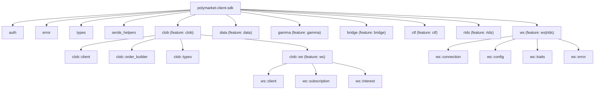

# CLAUDE.md

This file provides guidance to Claude Code (claude.ai/code) when working with code in this repository.

## Project Overview

Ergonomic Rust SDK for interacting with Polymarket services. Crate name: `polymarket-client-sdk` (published on crates.io). Provides strongly-typed API clients for the Central Limit Order Book (CLOB), market data, event discovery, cross-chain bridging, conditional token framework, and real-time WebSocket streams.

## Architecture Overview

Single-crate library (`src/lib.rs`) with feature-gated modules. No workspace; no binary targets. Async-first design built on `reqwest` + `tokio`. Uses `alloy` for Ethereum primitives and EIP-712 signing.

### Module Structure (Mermaid)



### Module Index

| Module | Feature Flag | Description |
|--------|-------------|-------------|
| `auth` | (always) | Authentication: L1 (EIP-712 signing), L2 (HMAC), Builder auth. Type-state: `Unauthenticated` / `Authenticated<K>` |
| `error` | (always) | Unified error type with `Kind` enum (Status, Validation, Synchronization, Internal, WebSocket, Geoblock) |
| `types` | (always) | Re-exports: `Address`, `Decimal`, `DateTime`, `ChainId`, `Signature`, `B256`, `U256` |
| `serde_helpers` | (always) | `StringFromAny` deserializer, `deserialize_with_warnings` (logs unknown fields when `tracing` enabled) |
| `clob` | `clob` | Core CLOB client -- orders, trades, markets, balances, rewards, streaming pagination |
| `clob::ws` | `ws` | WebSocket client for real-time orderbook, price, midpoint, and user event streams |
| `data` | `data` | Data API -- positions, trades, activity, leaderboards, open interest |
| `gamma` | `gamma` | Gamma API -- event/market discovery, search, tags, series, comments, sports |
| `bridge` | `bridge` | Bridge API -- cross-chain deposits (EVM, Solana, Bitcoin) |
| `ctf` | `ctf` | Conditional Token Framework -- split/merge/redeem outcome tokens on-chain |
| `rtds` | `rtds` | Real-time data streams -- crypto prices (Binance, Chainlink), comments |
| `ws` | `ws` or `rtds` | Shared WebSocket infrastructure -- `ConnectionManager`, reconnection, heartbeat |

## Build / Test / Lint Commands

```bash
# Build (all features)
cargo build --all-targets --all-features

# Test (default features -- runs unit tests only, no feature-gated tests)
cargo test

# Test (all features -- runs full test suite including integration tests)
cargo test --all-features

# Clippy (all features, deny warnings -- matches CI)
cargo clippy --all-targets --all-features -- -D warnings

# Clippy (no optional features)
cargo clippy --all-targets -- -D warnings

# Format check (requires nightly -- uses group_imports = "StdExternalCrate")
cargo +nightly fmt --all -- --check

# Format
cargo +nightly fmt --all

# Cargo.toml sorting check
cargo sort --check

# Benchmarks
cargo bench --all-features

# Coverage (requires cargo-llvm-cov)
cargo llvm-cov --all-features --workspace --lcov --output-path lcov.info

# Run example
cargo run --example unauthenticated --features clob,tracing
```

### MSRV

Rust **1.88.0** (edition 2024). CI pins `1.88` for clippy and tests. Nightly (`nightly-2025-11-24`) is required only for `rustfmt` (group_imports).

## Key Design Patterns

### Type-State Authentication

The CLOB client uses a **type-level state machine** to prevent misuse at compile time:

- `Client<Unauthenticated>` -- read-only endpoints only
- `Client<Authenticated<Normal>>` -- standard authenticated endpoints
- `Client<Authenticated<Builder>>` -- builder/institutional endpoints

Transition: `.authentication_builder(&signer).authenticate().await?` returns `Client<Authenticated<Normal>>`. Promotion to builder: `.promote_to_builder(config).await?`.

The `auth::Kind` trait (sealed) allows different auth flavors to inject extra headers.

### Order Builders

`OrderBuilder<Limit, K>` and `OrderBuilder<Market, K>` use phantom types for compile-time order kind enforcement. The `build()` method is async because it fetches tick size and fee rate from the CLOB before constructing the order.

### WebSocket Architecture

Shared `ws` module provides `ConnectionManager<M, P>` -- generic over message type `M` and parser `P: MessageParser<M>`. Features:
- Automatic reconnection with exponential backoff (`backoff` crate)
- PING/PONG heartbeat monitoring
- `broadcast` channel for multiple subscribers
- `watch` channel for connection state changes

The CLOB WS client (`clob::ws::Client`) layers on:
- `InterestTracker` -- bitflag-based filtering of incoming messages before deserialization
- `SubscriptionManager` -- reference-counted subscriptions with auto-resubscribe on reconnect
- Lazy channel creation per `ChannelType` (Market / User)

### Caching

The CLOB client caches `tick_size`, `neg_risk`, and `fee_rate_bps` per token using `DashMap` (concurrent hash map). These are fetched once per token and reused across order builds.

### Serde Helpers

- `deserialize_with_warnings`: When `tracing` feature is enabled, logs unknown fields in API responses (forward-compatible deserialization). Uses `serde_ignored` + `serde_path_to_error`.
- `StringFromAny`: Custom `serde_with` adapter that accepts both strings and integers.

## Feature Flags

| Feature | Optional Dependencies | Purpose |
|---------|----------------------|---------|
| `clob` | -- | Core CLOB client |
| `data` | -- | Data API |
| `gamma` | -- | Gamma API |
| `bridge` | -- | Bridge API |
| `ctf` | `alloy/contract`, `alloy/providers` | On-chain CTF operations |
| `rfq` | -- | RFQ endpoints (within CLOB) |
| `ws` | `backoff`, `bitflags`, `tokio`, `tokio-tungstenite` | WebSocket streaming |
| `rtds` | `backoff`, `tokio`, `tokio-tungstenite` | Real-time data streams |
| `heartbeats` | `tokio`, `tokio-util` | Auto heartbeat for CLOB sessions |
| `tracing` | `tracing`, `serde_ignored`, `serde_path_to_error` | Structured logging |

No default features are enabled.

## Key Dependencies

| Crate | Purpose |
|-------|---------|
| `alloy` | Ethereum primitives, EIP-712, signers (local + AWS KMS) |
| `reqwest` | HTTP client (rustls TLS) |
| `tokio` | Async runtime (optional, for WS/heartbeats) |
| `tokio-tungstenite` | WebSocket connections |
| `serde` / `serde_json` / `serde_with` | Serialization |
| `rust_decimal` | Arbitrary-precision decimals for prices/amounts |
| `dashmap` | Concurrent caching |
| `bon` | Builder derive macro |
| `chrono` | Date/time handling |
| `secrecy` | Secret string protection |
| `phf` | Compile-time perfect hash maps for contract configs |
| `hmac` / `sha2` / `base64` | HMAC authentication |
| `backoff` | Exponential backoff for WS reconnection |
| `httpmock` (dev) | HTTP mock server for integration tests |
| `criterion` (dev) | Benchmarking |

## Error Handling

Unified `Error` type with `Kind` enum:
- `Status` -- HTTP errors with status code, method, path, message
- `Validation` -- SDK-level validation errors
- `Synchronization` -- Concurrent auth state conflicts
- `Internal` -- Dependency errors (wrapped via `From` impls)
- `WebSocket` -- WS connection/parse/subscription errors
- `Geoblock` -- Geographic restriction errors

All public APIs return `crate::Result<T>` (alias for `std::result::Result<T, Error>`). Backtrace is captured on error construction.

## Test Strategy

- **Unit tests**: Inline `#[cfg(test)]` modules in most source files
- **Integration tests**: `tests/` directory with `httpmock`-based mocking
  - `tests/common/mod.rs` -- shared test utilities (authenticated client creation, mock setup)
  - `tests/clob.rs`, `tests/order.rs`, `tests/auth.rs`, `tests/websocket.rs`, `tests/data.rs`, `tests/gamma.rs`, `tests/bridge.rs`, `tests/ctf.rs`, `tests/rfq.rs`
- **Benchmarks**: `benches/` with `criterion` (`deserialize_clob`, `deserialize_websocket`, `clob_order_operations`)
- **Examples**: `examples/` -- extensive examples for each feature
- **CI**: GitHub Actions -- build+test on macOS/Windows, fmt+clippy+sort on Ubuntu, coverage with `cargo-llvm-cov` + Codecov

## Coding Conventions

- **Clippy**: `pedantic` + `cargo` lint groups at warn level, plus ~40 specific restriction lints. Key: `unwrap_used = "warn"`, `string_slice = "warn"`, `dbg_macro = "warn"`.
- **Formatting**: Nightly rustfmt with `group_imports = "StdExternalCrate"` (std -> external -> crate ordering)
- **Cargo.toml**: Must be sorted (`cargo sort --check`)
- **Commits**: Conventional commits required (enforced by CI)
- **Pre-commit**: hooks for trailing whitespace, file endings, YAML, large files, cargo-sort, fmt, clippy
- **`#[non_exhaustive]`**: Applied to all public structs and enums
- **`#[must_use]`**: Applied to pure functions
- **Sealed traits**: `State` and `Kind` traits are sealed to prevent external implementation
- **No `unwrap`** in library code (warn lint); tests use `#[allow(clippy::unwrap_used)]`
- **Edition 2024**: Uses `unsafe_op_in_unsafe_fn` and other 2024 defaults

## AI Usage Guidelines

- When adding new API endpoints, follow the existing pattern: request type in `types/request.rs`, response type in `types/response.rs`, client method in `client.rs`
- Use `bon::Builder` for request types
- Add `#[non_exhaustive]` to all new public types
- Add `#[serde(untagged)] Unknown(String)` variant to new enums for forward compatibility
- Use `U256` (not `String`) for token IDs
- Use `Decimal` for prices and amounts
- Feature-gate new modules appropriately
- Add integration tests with `httpmock`
- Run `cargo +nightly fmt --all` and `cargo clippy --all-targets --all-features -- -D warnings` before committing

## Contract Configuration

Static contract addresses for Polygon (137) and Amoy testnet (80002) are defined in `src/lib.rs` using `phf_map`. Includes exchange, collateral (USDC), conditional tokens, and neg-risk adapter contracts.

Wallet derivation: `derive_proxy_wallet()` and `derive_safe_wallet()` compute deterministic CREATE2 addresses for Polymarket proxy/Safe wallets.

## Important File Paths

- `src/lib.rs` -- Crate root, contract configs, wallet derivation, `ToQueryParams` trait, generic `request()` fn
- `src/auth.rs` -- All authentication logic (L1, L2, Builder, state types, HMAC)
- `src/clob/client.rs` -- Main CLOB client (~1800 lines), all HTTP endpoints
- `src/clob/order_builder.rs` -- Limit/Market order construction
- `src/clob/types/mod.rs` -- Core trading types (Order, Side, OrderType, SignedOrder, TickSize, Amount)
- `src/clob/ws/client.rs` -- WebSocket client with type-state auth
- `src/ws/connection.rs` -- Generic WebSocket connection manager
- `src/error.rs` -- Unified error types
- `Cargo.toml` -- Dependencies, features, lint configuration, benchmarks, examples
